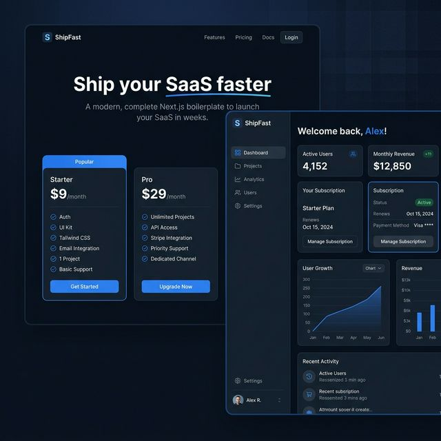

# Next.js SaaS Starter Kit

A comprehensive, production-ready foundation designed to help founders and agencies launch fully functional SaaS products in hours instead of months.

✔ Saves $10k+ in initial development costs by providing pre-built auth, billing, and dashboards
✔ Guarantees enterprise-grade scalability with Next.js 14, Supabase, and strict TypeScript
✔ Ensures seamless revenue collection via a completely integrated Stripe subscription flow

## Use Cases
- **Startup MVPs:** Instantly validate a new SaaS idea with a fully functioning subscription model.
- **Agency Deliverables:** Provide clients with a high-performance web app foundation in record time.
- **Internal Tools:** Quickly spin up secure, authenticated dashboards for internal business operations.

---

## Tech Stack

- **Next.js 14** — App Router, Server Components, API Routes
- **TypeScript** — strict mode
- **Supabase** — Auth + PostgreSQL database
- **Stripe** — Subscriptions, webhooks, Customer Portal
- **Tailwind CSS** — utility-first styling

---

## Project Structure

```
app/
├── page.tsx                    # Landing + pricing
├── dashboard/
│   └── page.tsx                # Protected dashboard
├── api/
│   └── webhooks/stripe/
│       └── route.ts            # Stripe webhook handler
lib/
├── supabase/server.ts          # Server-side Supabase client
└── stripe.ts                   # Stripe client + plan config
```

---

## Setup

```bash
git clone https://github.com/bck-stack/nextjs-saas-boilerplate
cd nextjs-saas-boilerplate
npm install
cp .env.example .env.local
# Fill in Supabase and Stripe keys
npm run dev
```

---

## Supabase Schema

```sql
create table subscriptions (
  id uuid primary key default gen_random_uuid(),
  user_id uuid references auth.users not null,
  stripe_subscription_id text unique,
  stripe_customer_id text,
  status text default 'inactive',
  current_period_end timestamptz,
  updated_at timestamptz default now()
);
alter table subscriptions enable row level security;
create policy "Users see own subscription" on subscriptions
  for select using (auth.uid() = user_id);
```

---

## Stripe Webhook Setup

```bash
# Local testing with Stripe CLI
stripe listen --forward-to localhost:3000/api/webhooks/stripe

# Events to enable in Stripe dashboard:
# checkout.session.completed
# customer.subscription.updated
# customer.subscription.deleted
```

---

## Screenshot



---

## License

MIT
