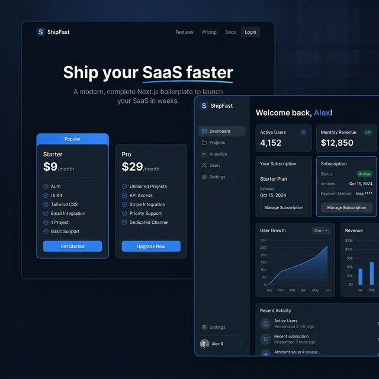

# Next.js SaaS Starter Kit

A comprehensive, production-ready foundation designed to help founders and agencies launch fully functional SaaS products in hours instead of months.

✔ Saves $10k+ in initial development costs by providing pre-built auth, billing, and dashboards
✔ Guarantees enterprise-grade scalability with Next.js 14, Supabase, and strict TypeScript
✔ Ensures seamless revenue collection via a completely integrated Stripe subscription flow

## Use Cases
- **Startup MVPs:** Instantly validate a new SaaS idea with a fully functioning subscription model.
- **Agency Deliverables:** Provide clients with a high-performance web app foundation in record time.
- **Internal Tools:** Quickly spin up secure, authenticated dashboards for internal business operations.

---

## Tech Stack

- **Next.js 14** — App Router, Server Components, Server Actions, Route Handlers, Middleware
- **TypeScript** — strict mode
- **Supabase** — Auth (email/password, confirmation, password reset) + PostgreSQL with RLS
- **Stripe** — Checkout, Customer Portal, webhooks
- **Tailwind CSS** — utility-first styling
- **Vitest** — unit tests

---

## Features

- Sign up / sign in / sign out, email confirmation and password reset flows
- Session refresh and route protection in `middleware.ts` (`/dashboard/*` requires login)
- Pricing → Checkout → subscription synced to Supabase (on the success redirect **and** via webhook)
- Billing page: subscribe, or manage/cancel/update card in the Stripe Customer Portal
- Entitlements: `active`/`trialing` unlock paid features, canceled plans keep access until period end,
  `past_due` shows a payment warning
- Settings page: profile name and password change
- Safe defaults: open-redirect protection, service-role key only on the server, no duplicate Stripe customers,
  clear setup notices instead of crashes when env vars are missing

---

## Project Structure

```
app/
├── page.tsx                        # Landing + pricing
├── (auth)/login | signup | forgot-password
├── auth/actions.ts                 # Server actions: login, signup, reset, profile, password
├── auth/callback/route.ts          # Email link → session
├── auth/signout/route.ts
├── dashboard/
│   ├── layout.tsx                  # Sidebar, auth guard
│   ├── page.tsx                    # Overview
│   ├── billing/page.tsx            # Plans / portal
│   ├── billing/success/route.ts    # Post-checkout sync
│   └── settings/                   # Profile + password
└── api/
    ├── checkout/route.ts           # Create Checkout session
    ├── portal/route.ts             # Customer Portal
    └── webhooks/stripe/route.ts    # Stripe events → Supabase
lib/
├── plans.ts                        # Plan catalogue, entitlement logic (unit-tested)
├── stripe.ts                       # Stripe client + helpers
├── subscriptions.ts                # Stripe subscription → DB row sync
├── session.ts                      # requireUser()
└── supabase/{server,admin,middleware}.ts
supabase/schema.sql                 # Table + RLS policies
middleware.ts
```

---

## Setup

```bash
git clone https://github.com/bck-stack/nextjs-saas-starter-kit
cd nextjs-saas-starter-kit
npm install
cp .env.example .env.local
# Fill in Supabase and Stripe keys
npm run dev
```

1. **Supabase** — create a project, run `supabase/schema.sql` in the SQL editor, and add
   `http://localhost:3000/auth/callback` (and your production URL) under Auth → URL Configuration → Redirect URLs.
2. **Stripe** — create two recurring prices and put their IDs in `STRIPE_STARTER_PRICE_ID` / `STRIPE_PRO_PRICE_ID`.
   Enable the Customer Portal (Settings → Billing → Customer portal).
3. **Webhook** — see below.

---

## Stripe Webhook Setup

```bash
# Local testing with Stripe CLI (prints the whsec_… secret for STRIPE_WEBHOOK_SECRET)
stripe listen --forward-to localhost:3000/api/webhooks/stripe
```

Events to enable in the Stripe dashboard:

```
checkout.session.completed
customer.subscription.created
customer.subscription.updated
customer.subscription.deleted
invoice.paid
invoice.payment_failed
```

The webhook always re-reads the subscription from Stripe and upserts it with the **service-role** client,
so events arriving out of order still end in the correct state. Failures return `500` so Stripe retries.

---

## Scripts

```bash
npm run dev        # development server
npm run build      # production build
npm run lint       # ESLint
npm run typecheck  # tsc --noEmit
npm test           # vitest
```

---

## Screenshot



---

## License

MIT
